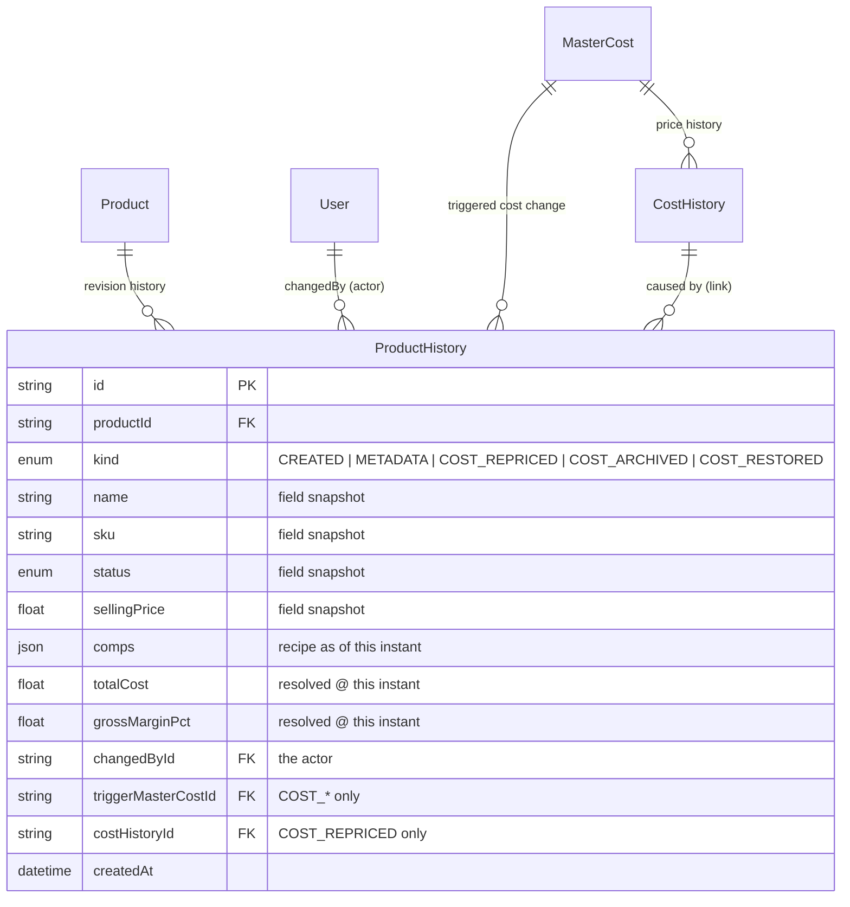
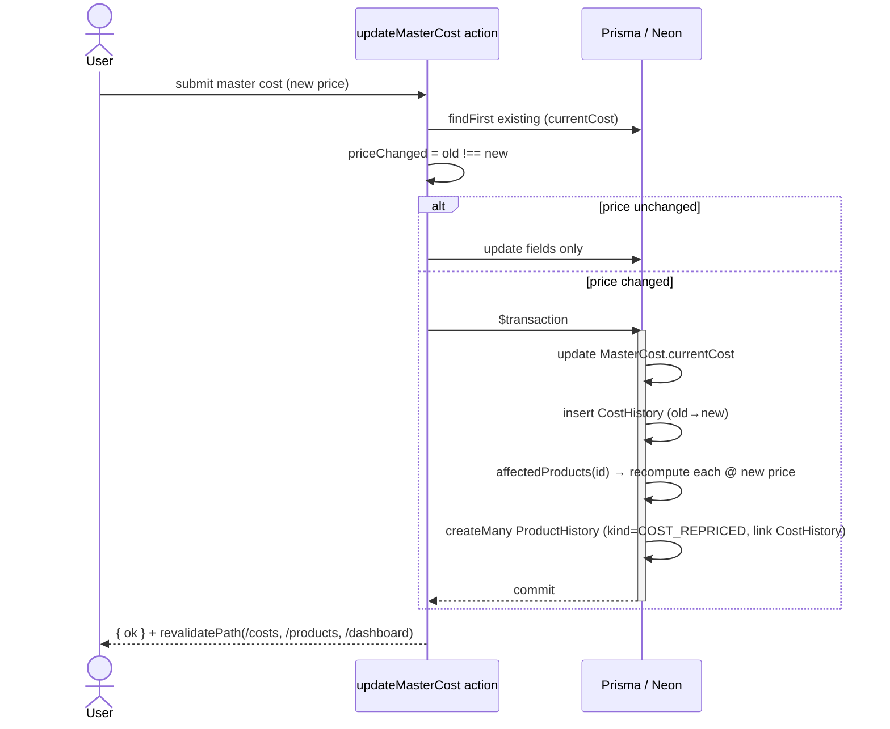
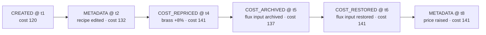

# Product History — Flow & Data Model

_Last updated: 2026-07-08 · Status: **implemented** (backend + migrations + full UI)_

Implemented in: `prisma/schema.prisma` (`ProductHistory` + `ProductHistoryKind`), migrations
`20260708172350_add_product_history` and `20260708180608_product_history_lines`,
`src/server/product-history.ts` (`snapshotProducts` helper), the write paths in
`src/server/actions/product-actions.ts` (`createProduct` / `updateProduct`) and
`src/server/actions/cost-actions.ts` (`updateMasterCost` / `archiveMasterCost` /
`restoreMasterCost`), the `getProductHistory` reader, and the UI: a "History" sparkline
column (`product-history-cell.tsx`) in the products table opening a wide master-detail
revision drawer (`product-history-drawer.tsx`), plus a "Revision history" affordance in the
preview drawer.

Reference for **how a product's revision history is captured and read**. It records every
event that changed a product — as a single append-only timeline — with a distinct `kind`
per event so the log is self-explaining:

- `CREATED` — product first saved.
- `METADATA` — the product's *own* fields changed (name / SKU / status / selling price /
  recipe).
- `COST_REPRICED` — a referenced master cost's **price** changed.
- `COST_ARCHIVED` — a referenced master cost was **archived** (its line drops out of the
  total).
- `COST_RESTORED` — a referenced master cost was **restored** (its line re-enters the
  total).

Each `COST_*` row links to the `MasterCost` that triggered it; `COST_REPRICED` also links
the exact `CostHistory` row — so the price-book log and the product log cross-reference
each other.

Hierarchy: `MasterCost → CostHistory` (price book) and `Product → ProductHistory` (SKU).

---

## The three design rules

1. **One event per cause, one timeline.** A `ProductHistory` row is written both when the
   product itself is saved (`CREATED` / `METADATA`) **and** when a referenced master cost
   moves the product's cost — a separate event kind per cause (`COST_REPRICED`,
   `COST_ARCHIVED`, `COST_RESTORED`), fanned out to each affected SKU. The timeline
   interleaves all of them, ordered by time.

2. **Each row is self-contained.** Reconstructing a past cost by joining the *current*
   recipe against *past* prices is invalid — the recipe also moves over time. So each row
   stores the recipe **and** the cost resolved at that instant. Reading history never needs
   a join. The stored cost is a point-in-time *record*, not a live cache — current cost is
   still computed on read (Live Reference Architecture is preserved; history rows never feed
   a current display).

3. **Every row is attributed.** `changedById` is the actor. Every `COST_*` row links to the
   `MasterCost` that triggered it, and `COST_REPRICED` also links the exact `CostHistory`
   row — so you can pivot between "this price change hit these N SKUs" and "this SKU's cost
   moved because of that price change."

---

## Data model

---

## Write path — both triggers write a row

```mermaid
flowchart TD
    subgraph PE["Product edit → CREATED / METADATA revision"]
        A[User saves product] --> B{createProduct / updateProduct}
        B -->|create| C[Build comps from live price book]
        B -->|update| D[Load existing · diff tracked fields]
        D --> E{Tracked field changed?}
        E -->|no| F[Update only · NO row]
        E -->|yes| G[computeForProduct → cost, margin]
        C --> G
        G --> H[TX: write Product +<br/>ProductHistory kind=CREATED/METADATA]
    end

    subgraph MC["Master-cost cost move → COST_* revisions (fan-out)"]
        M[Master-cost action] --> N{which action?}
        N -->|"name/unit/type only\n(no cost move)"| P[Update fields only · NO product rows]
        N -->|price changed| O1[BEGIN TX]
        N -->|archive| O2[BEGIN TX]
        N -->|restore| O3[BEGIN TX]
        O1 --> RA[Update price + insert CostHistory]
        O2 --> RB[Set archived = true]
        O3 --> RC[Set archived = false]
        RA --> KA[["kind = COST_REPRICED<br/>link CostHistory + MasterCost"]]
        RB --> KB[["kind = COST_ARCHIVED<br/>link MasterCost"]]
        RC --> KC[["kind = COST_RESTORED<br/>link MasterCost"]]
        KA --> S[affectedProducts → recompute each live]
        KB --> S
        KC --> S
        S --> T[createMany ProductHistory in same TX]
        T --> U[COMMIT]
    end
```

Both the product write **and** the fan-out write happen in **one transaction** with their
audit rows — the atomic invariant `updateMasterCost` already enforces for `CostHistory`
(and which `archiveMasterCost` / `restoreMasterCost` must adopt: today they're a bare
`updateMany`, so they need to become a transaction to fan out atomically).

**Fan-out is bounded:** the only cost-moving master-cost paths are `updateMasterCost`,
`archiveMasterCost`, and `restoreMasterCost` — each a single interactive edit. CSV import
only *creates* master costs; the what-if simulator never commits. So a fan-out is one
edit's worth of affected SKUs, inserted as a single `createMany`.

---

## Write path — sequence (master-cost price edit)

`archiveMasterCost` / `restoreMasterCost` follow the same shape — flip `archived` in a
transaction, recompute with the new state, `createMany` `COST_ARCHIVED` / `COST_RESTORED`
rows (no `CostHistory` link).

---

## Read path — one interleaved timeline

Because cost revisions are materialized, the timeline is complete with **no reconstruction
and no join** — each row is self-describing and tagged by `kind`:

Each `COST_REPRICED` node deep-links to the `CostHistory` row that caused it, and
vice-versa; `COST_ARCHIVED` / `COST_RESTORED` nodes link to the `MasterCost`.

---

## Implementation footprint

- **Schema:** `enum ProductHistoryKind { CREATED, METADATA, COST_REPRICED, COST_ARCHIVED,
  COST_RESTORED }`; add `ProductHistory`; back-relations on `Product` (`history`), `User`
  (`productChanges`), `MasterCost` (`productRevisions`), and `CostHistory`
  (`productRevisions`); one migration.
- **`createProduct`:** write a baseline `CREATED` row.
- **`updateProduct`:** load existing tracked fields, diff, and — only when something changed
  — write Product + a `METADATA` row in one `$transaction`.
- **`updateMasterCost`:** on `priceChanged`, after the `CostHistory` insert, fan out inside
  the same transaction — `affectedProducts` → recompute each at the new price →
  `createMany` `COST_REPRICED` rows linking the `CostHistory` + `MasterCost`.
- **`archiveMasterCost` / `restoreMasterCost`:** promote from bare `updateMany` to a
  `$transaction` — flip `archived`, then the same fan-out (`affectedProducts` → recompute
  with the new archived state → `createMany` `COST_ARCHIVED` / `COST_RESTORED` rows,
  `costHistoryId = null`).
- **Row shape:** each row stores the **resolved per-line breakdown** (`lines` JSON:
  name/unit/qty/unitCost/lineCost/needsAttention) in addition to the summary, so the detail
  view renders faithfully with no join. `snapshotProducts` persists `CostResult.lines`
  directly. (Rows written before the `lines` column degrade gracefully — the detail pane
  shows "No component lines recorded.")
- **Reader:** `getProductHistory(productId)` — reads the timeline tenant-safely through the
  scoped `Product` (mirroring how `CostHistory` is reached via `MasterCost`), newest-first,
  with a per-row cost delta vs. the previous revision and the per-line breakdown.
- **UI:**
  - A **"History" column** in the products table — a compact cost sparkline over recent
    revisions (`product-history-cell.tsx`), rust when trending up / mint when down; a muted
    icon when a product has no revisions yet. `searchProducts` returns `costHistory` +
    `revisionCount`.
  - A wide (**720px**) **master-detail revision drawer** (`product-history-drawer.tsx`):
    a selectable timeline rail (per-row `kind` badge + cost delta) on the left, and the
    selected revision's full detail on the right — stat tiles, the cost breakdown *as of
    then*, and the field snapshot.
  - The preview drawer links to it via a compact "Revision history → View log" affordance.

A shared helper (`snapshotProduct(tx, product, kind, trigger)`) keeps the four write paths
consistent — computes the resolved cost and inserts the row — so the snapshot shape is
defined in exactly one place.

---

## Non-triggers (no ProductHistory row)

- **Template edits / clone don't touch products.** `saveTemplateForm` only rewrites the
  template's own `TemplateComponent` rows and mints a new immutable `TemplateVersion` — it
  writes zero `Product` rows. Existing products resolve their recipe from their own `comps`
  or a **pinned** prior `templateVersion` (never the live template lines), so adding a
  component to a template changes **neither product structure nor product cost**, and no
  revision is written. A product only adopts template changes when it is **re-saved** — and
  even then the edit form seeds from the product's own `comps`, not the template, so nothing
  is silently injected; that re-save is a normal `METADATA` revision.
- **Master-cost rename / unit / type edits.** Labels resolve live and don't move cost.
- **Deleting a template** cascade-deletes its products; their history rows cascade away with
  them (`ProductHistory.productId` is `onDelete: Cascade`) — no surviving product to record.

## Decided

- **Archive / restore are their own events.** Archiving excludes a line from the total, so
  it moves affected products' cost; `archiveMasterCost` / `restoreMasterCost` each fan out
  their own kind — `COST_ARCHIVED` / `COST_RESTORED` (`costHistoryId = null`,
  `triggerMasterCostId` set) — distinct from `COST_REPRICED`, for a faithful and
  self-explaining cost timeline.

- **Row shape: full per-line breakdown.** Each row stores the resolved `lines` (not just the
  `totalCost`/margin summary), so the revision detail view renders the exact breakdown as of
  that instant — self-contained, no join. Cheap: `computeProductsLive` already returns them.

---

> ⚠️ Sibling doc note: `mutation-cascade-behavior.md` still describes the older cached-cost
> model (`recomputeForMasterCost`, persisted `totalCost`/`grossMarginAmount` on `Product`).
> The current code is Live Reference (no cached cost columns, no recompute fan-out); that
> doc predates the migration and should be read with that caveat.
